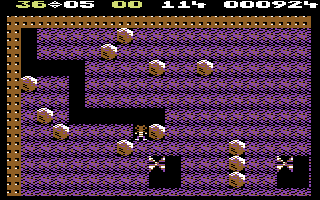

# Retro-Game-Remake

Table Of Content:
* [Description](#Description)
* [Games](#Games)
* [Install & Run](#Install&Run)

<a id="Description"></a>
## Description

We are recreating retro games using modern HTML / W3CSS and Javascript. Heavily using canvas capabilities to run the game. It is a Desktop only platform game ... for time being.

<a id="Games"></a>
## Games

| Title | Platform | Type | Image | Link |  
|---|---|---|---|---|  
| BoulderDash | C64 | maze-based puzzle |  | [README](./BoulderDash/README.md)|

<a id="Install&Run"></a>
## Install & Runs


Install the demo `npm install`
```
added 48 packages, and audited 49 packages in 559ms

15 packages are looking for funding
  run `npm fund` for details

found 0 vulnerabilities
```

Start the demo `npm start`
```
> retro-game-remake@1.0.0 start
> npx http-server -c-1 .

Starting up http-server, serving .

http-server version: 14.1.1

http-server settings: 
CORS: disabled
Cache: -1 seconds
Connection Timeout: 120 seconds
Directory Listings: visible
AutoIndex: visible
Serve GZIP Files: false
Serve Brotli Files: false
Default File Extension: none

Available on:
  http://127.0.0.1:8080
  http://192.168.1.151:8080
Hit CTRL-C to stop the server
```

Run the demo: [http:/localhost:8080/](http://localhost:8080/)
